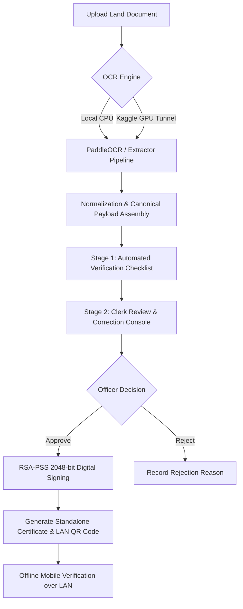

# Offline Land Document Extraction & Standalone Verification Console

A complete, standalone local application for extracting structured data from Indian land records (Sale Deeds, Agreements of Sale, GPAs) using OCR, executing automated validation checks, providing human-in-the-loop clerk corrections, and applying local **RSA-PSS (2048-bit) cryptographic digital seals** with offline QR code verification over local network (LAN).

---

## Key Features

- **Dual OCR Extraction Modes:**
  - **Local CPU Mode:** Runs directly on local CPU without external dependencies.
  - **Remote GPU Mode:** Optional connection to high-speed Kaggle/Colab GPU workers for accelerated OCR inference.
- **State-Aware & Continuation-Safe Field Extraction:**
  - Extracts canonical document facts: `document_type`, `document_number`, `serial_number`, `document_date`, `execution_date`, `parties`, `survey_number`, `sub_survey_number`, `village`, `mandal`, `district`, `stamp_number`, `stamp_value`, and `sold_to`.
  - Intelligently parses complex Indian survey designations (e.g. `CSNO.2(65/9`, `Sy.No`, `Patta No`).
  - Implements multi-page continuation safety (`CONTINUES_ON_NEXT_PAGE`), preserving explicit Page 1 facts while avoiding hallucinating missing schedules.
- **Verification Workflow Console:**
  - **Stage 1 — Automated Validation:** Evaluates required fields, area numeric boundaries, date logic, and survey formats.
  - **Stage 2 — Clerk Review & Correction:** Interactive editor allowing clerks to verify and correct OCR errors prior to certification.
  - **Stage 3 — Officer Approval / Rejection:** Officer approval seals the reviewed document facts; rejection records non-certified status with clear feedback.
- **Local RSA-PSS 2048-bit Cryptographic Sealing:**
  - Computes deterministic SHA-256 / RSA-PSS signatures over canonical JSON representations (`canonicalize_document`).
  - Maintains strict immutability for certified records (`APPROVED`).
- **Offline LAN QR Code Verification:**
  - Automatically generates an offline client-side QR code bound to the host's local network IP (`0.0.0.0`).
  - Mobile devices on the same Wi-Fi/LAN can scan the QR code to view a standalone verification certificate and validate the signature instantly.

---

## Architecture & Workflow



---

## Security & Architectural Constraints

- **100% Standalone & Offline:** Zero external REST APIs, cloud databases, CDNs, or authentication servers required.
- **Local Key Storage:** Persists RSA-PSS 2048-bit keypairs in local `verification_keys/` directory.
- **JSON Database Persistence:** All verification records are stored locally in `verification_db.json`.

---

## Setup & Installation

### Prerequisites

- Python 3.10+
- `pip`

### 1. Clone Repository

```bash
git clone https://github.com/Samarth7887/Chatgpt-land.git
cd Chatgpt-land
```

### 2. Install Dependencies

```bash
pip install cryptography opencv-python numpy pypdfium2 pillow requests
```
*(Optional for local CPU OCR: `pip install paddleocr paddlepaddle`)*

---

## Running the Application

### Start Web Server

```bash
python web_app.py
```
Or specify a custom port:
```powershell
$env:PORT=8020; python -u web_app.py
```

- **Local Access:** `http://localhost:8020`
- **LAN Access:** `http://<YOUR_LOCAL_IP>:8020` (e.g. `http://10.71.0.80:8020`)

---

## Testing & Verification

Run the core test suite and regression tests:

```bash
# Python compilation check
python -m py_compile land_document_extractor.py verification_service.py web_app.py

# Core verification integration tests
python scratch/test_integration.py

# Form binding tests
python scratch/test_json_to_console_mapping.py

# Extraction layer regression tests
python scratch/test_extraction_fixes.py
```

---

## Repository Structure

```
├── web_app.py                 # HTTP server, UI layout, postback handling & LAN binding
├── verification_service.py    # Local RSA-PSS signing, validation checks & DB persistence
├── land_document_extractor.py # Document OCR line parser, field extraction & continuation logic
├── verification_keys/         # Persisted local RSA-PSS 2048-bit keys (Git-ignored)
├── verification_db.json       # Local JSON database for records (Git-ignored)
└── .gitignore                 # Excludes local keys, DBs, and virtual environments
```
