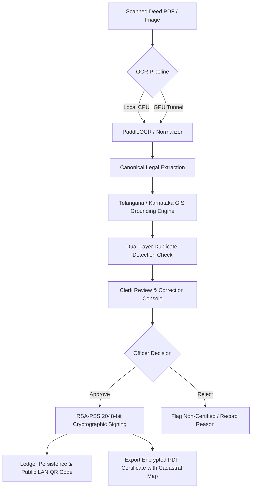

# OneBhoomi (వన్‌భూమి / वनभूमि) 🏛️📜

**Air-Gapped Land Record Extraction, Cadastral GIS Grounding & RSA-PSS Cryptographic Sealing Console**

OneBhoomi is a production-grade, offline-first government registry application engineered for Indian sub-registrar offices. It reads scanned physical deed documents (Sale Deeds, Agreements of Sale, General Power of Attorney), extracts canonical legal facts, grounds land parcels against official Telangana (TGRAC) and Karnataka cadastral GIS datasets, prevents double-registration through duplicate ledger checks, allows clerk review/correction, and cryptographically seals every approved deed with local **RSA-PSS (2048-bit)** digital signatures.

---

## 🌟 Key Capabilities

1. **Air-Gapped & Offline Security**
   - 100% self-contained Python architecture with zero external cloud dependencies.
   - Local RSA-PSS (2048-bit) private key generation and management in secure local storage.
   - Built for air-gapped government registry workstations and offline intranet LANs.

2. **Hybrid OCR Extraction & Pipeline**
   - **Local CPU Engine:** Native PaddleOCR / lightweight pipeline directly on device.
   - **Remote GPU Acceleration:** Automated, transparent tunnel integration with remote Kaggle / Colab GPU workers (`T4 x2`) via `kaggle_gpu_server.py`.

3. **Domain-Aware Legal Entity & Survey Parsing**
   - Normalizes 14+ canonical property fields: document dates, execution dates, parties (vendors, purchasers, claimants), stamp duty values, serial numbers, and complex survey numbers (`CSNO.2(65/9`, `Sy.No`, `Patta No`, etc.).
   - Multi-page continuation detection (`CONTINUES_ON_NEXT_PAGE`) to safeguard Schedule of Property boundaries.

4. **Cadastral GIS Spatial Grounding (Telangana TGRAC & Karnataka)**
   - High-performance offline spatial index with 11,000+ Telangana revenue villages and survey centroids.
   - Automatic coordinate resolution, survey-boundary validation, and visual parcel mapping.

5. **Dual-Layer Duplicate & Double-Registration Prevention**
   - **Layer 1 (Cryptographic Hash):** Instant SHA-256 binary hash detection prevents uploading identical scans.
   - **Layer 2 (Canonical Identity Ledger):** Matches normalized `document_number`, `survey_number`, and `village` against existing sealed records.
   - Automatically blocks officer approval for duplicates and provides direct links to the existing sealed certificate.

6. **Interactive Clerk Review & Officer Approval Console**
   - Side-by-side zoomable document scan preview alongside editable structured fields.
   - Automated multi-rule Schedule A checklist (required fields, area consistency, date logic, survey formatting).
   - Clerk audit trail and corrections logged before final officer digital signature.

7. **Cryptographic Sealing & Offline LAN QR Verification**
   - Deterministic JSON canonicalization signed with RSA-PSS SHA-256.
   - Standalone offline verification certificates with dynamic QR code accessible across the local network (LAN) and public tunnels.

8. **Exportable Sealed PDF Certificate with PIN Lock & Cadastral Map**
   - Download official, court-admissible PDF certificates.
   - Optional RC4 128-bit owner/user password protection (PIN lock).
   - Includes full transaction metadata, cryptographic hashes, verification seal, and embedded high-resolution GIS cadastral survey map.

9. **Multilingual Operational Dashboard & Analytics**
   - Real-time KPIs: Total on File, Sealed & Certified, Clerk Review Queue, Non-Certified.
   - Vector SVG analytics: Registration Velocity trend and Document Classification breakdown.
   - Instant language switcher supporting **English, Hindi (हिंदी), Telugu (తెలుగు), Kannada (ಕನ್ನಡ), and Tamil (தமிழ்)**.

---

## 🏛️ System Architecture



---

## 🚀 Quick Start

### Prerequisites
- Python 3.10+
- Modern Web Browser

### Installation

```bash
# Clone the repository
git clone https://github.com/yuvanreddy404/onebhoomi.git
cd onebhoomi

# Install dependencies
pip install cryptography opencv-python numpy pypdfium2 pillow requests
```

### Start the Console

```bash
python web_app.py
```

By default, the server runs on port `8001` (or custom port via `PORT=8020 python web_app.py`):
- **Dashboard:** [http://localhost:8001/dashboard](http://localhost:8001/dashboard)
- **New Document Intake:** [http://localhost:8001/new](http://localhost:8001/new)
- **Landing Page:** [http://localhost:8001/](http://localhost:8001/)

---

## 📁 Repository Structure

```
├── web_app.py                  # HTTP server, routing, review console, and intake desk
├── verification_service.py     # RSA-PSS 2048 signing, duplicate check, and validation rules
├── certificate_pdf_service.py  # Court-admissible PDF generator with GIS map & PIN lock
├── dashboard_view.py           # Multilingual analytics dashboard, KPIs & master ledger
├── gis_service.py              # Spatial grounding engine for Telangana & Karnataka surveys
├── land_document_extractor.py  # Rule-based OCR line parser and continuation logic
├── semantic_extractor.py       # Normalized legal document schema builder
├── update_ocr_url.py           # Remote GPU tunnel sync and status verification
├── kaggle_gpu_server.py        # Remote GPU OCR worker script
├── 01-onebhoomi-final.html     # Landing page UI
├── logo.png                    # OneBhoomi brand emblem
└── README.md                   # System documentation
```

---

## 🔒 Security & Privacy Notice
OneBhoomi is strictly architected for privacy. No document scans, property identities, party names, or biometric records leave the local runtime environment. Cryptographic keys are generated locally on first seal and remain solely under the authority of the deploying sub-registrar office.
